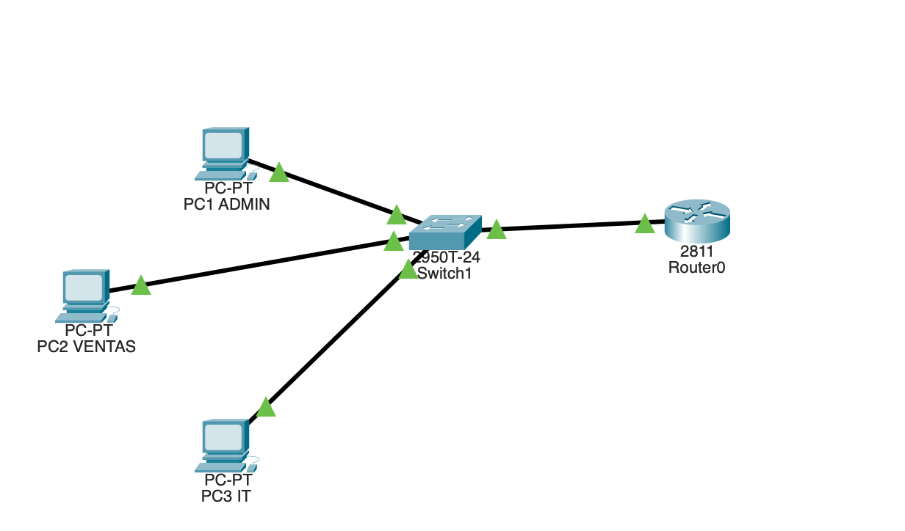
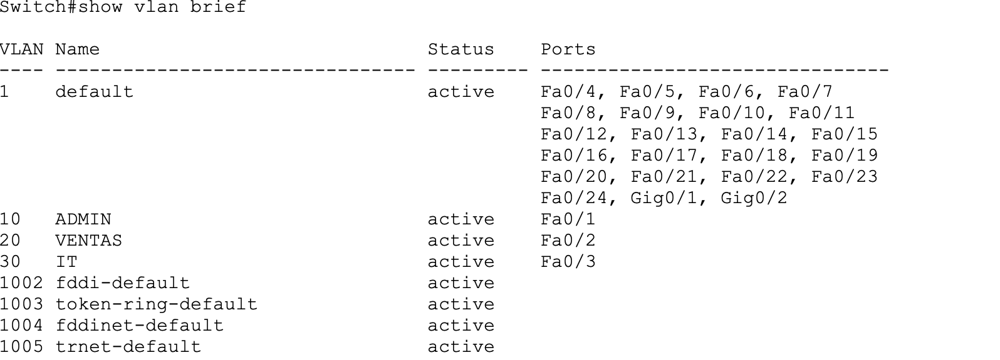
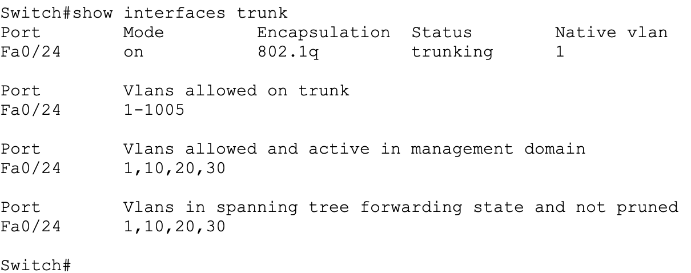
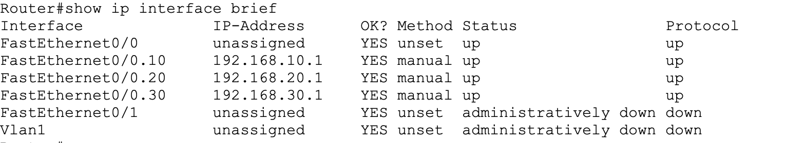
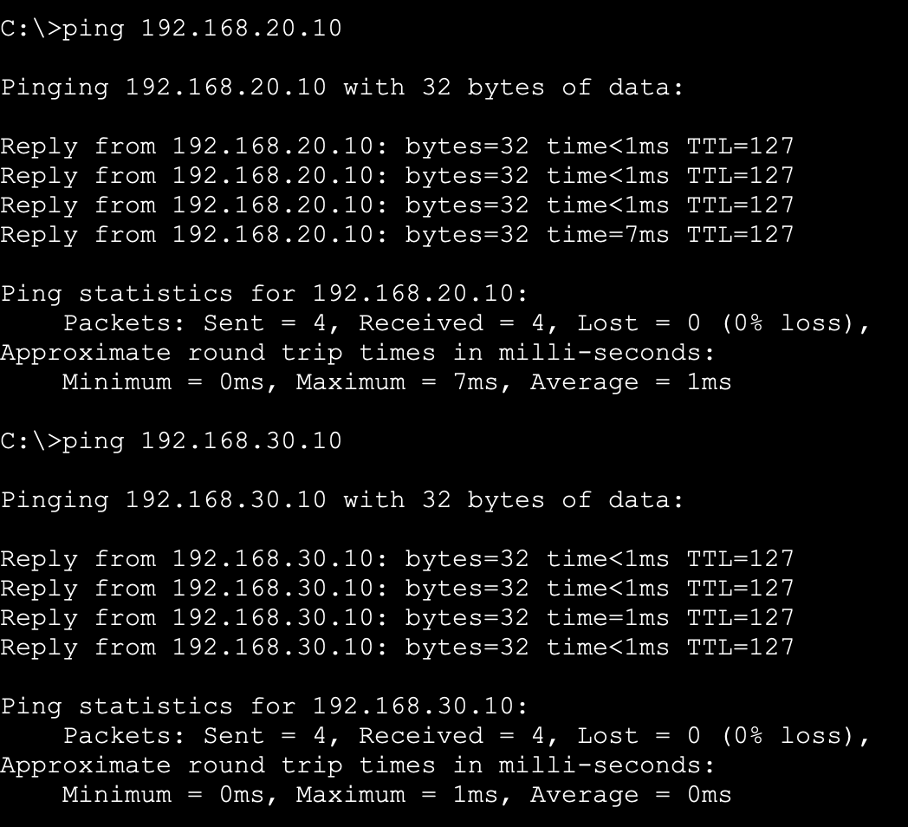
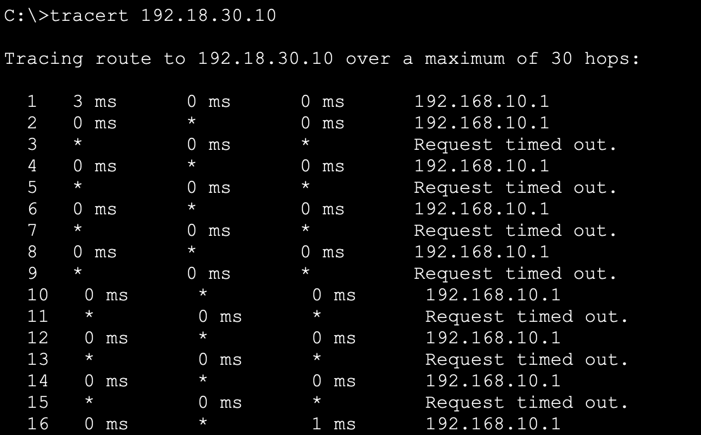

## Inter-VLAN Routing (Router on a Stick)
## 📌 Descripción

En este proyecto se ha diseñado e implementado una red segmentada mediante VLANs para separar distintos departamentos de una empresa (Administración, Ventas e IT).

Para permitir la comunicación entre las diferentes VLANs se ha configurado Inter-VLAN Routing utilizando Router on a Stick en Cisco Packet Tracer.

El router realiza el enrutamiento entre VLANs mediante subinterfaces y encapsulación IEEE 802.1Q, mientras que el switch gestiona la segmentación de la red mediante VLANs y enlaces trunk.

## 🗺️ Topología de red

La red está compuesta por:

- 1 Router
- 1 Switch
- 3 VLANs
- 3 Equipos finales
- Enlace trunk entre switch y router

## 🧩 Diseño de red

La red se ha dividido en tres VLANs correspondientes a distintos departamentos:

-V LAN	Departamento	Red
- 10	ADMIN	192.168.10.0/24
- 20	VENTAS	192.168.20.0/24
- 30	IT	192.168.30.0/24

Cada VLAN tiene su propia red y su puerta de enlace configurada en el router.

## ⚙️ Configuración
Switch

En el switch se han creado las VLANs, se han asignado los puertos de acceso a cada VLAN y se ha configurado un enlace trunk hacia el router para permitir el tráfico de todas las VLANs.

Router

En el router se han configurado subinterfaces en la interfaz física utilizando encapsulación 802.1Q.
Cada subinterfaz actúa como puerta de enlace de su VLAN correspondiente.

Ejemplo de configuración:

interface fa0/0
no shutdown

interface fa0/0.10
encapsulation dot1Q 10
ip address 192.168.10.1 255.255.255.0

interface fa0/0.20
encapsulation dot1Q 20
ip address 192.168.20.1 255.255.255.0

interface fa0/0.30
encapsulation dot1Q 30
ip address 192.168.30.1 255.255.255.0
## 🌐 Direccionamiento IP
Dispositivo	IP	Gateway
PC-ADMIN	192.168.10.10	192.168.10.1
PC-VENTAS	192.168.20.10	192.168.20.1
PC-IT	192.168.30.10	192.168.30.1
## 🧪 Verificación y pruebas

Para verificar el funcionamiento de la red se han realizado las siguientes pruebas:

- Comprobación de VLANs en el switch
- Comprobación del enlace trunk
- Comprobación de subinterfaces en el router
- Ping entre equipos de diferentes VLANs
- Traceroute para verificar el paso por el router
## VLANs configuradas

## Enlace trunk

## Interfaces del router

## Ping entre VLANs

## Traceroute

Las pruebas confirman que existe conectividad entre las distintas VLANs y que el router enruta correctamente el tráfico entre ellas.

## 🛠️ Tecnologías utilizadas
- Cisco Packet Tracer
- VLAN
- Trunking
- Inter-VLAN Routing
- Router on a Stick
- Redes LAN
- Routing
## 🎯 Objetivos del proyecto
- Segmentar una red mediante VLANs
- Configurar puertos access
- Configurar enlace trunk
- Implementar Inter-VLAN Routing
- Configurar subinterfaces en router
- Permitir comunicación entre VLANs
- Verificar conectividad mediante ping y traceroute
